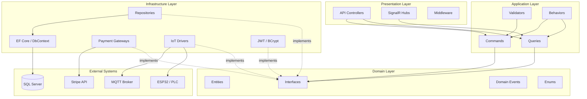
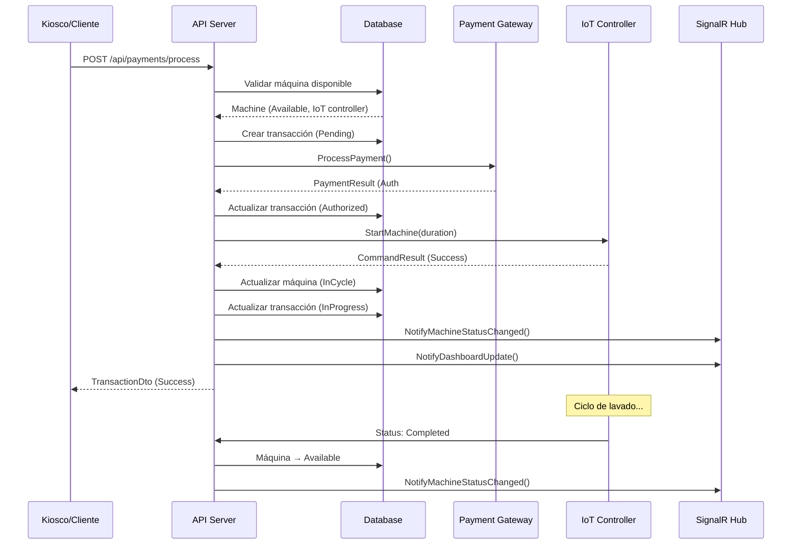
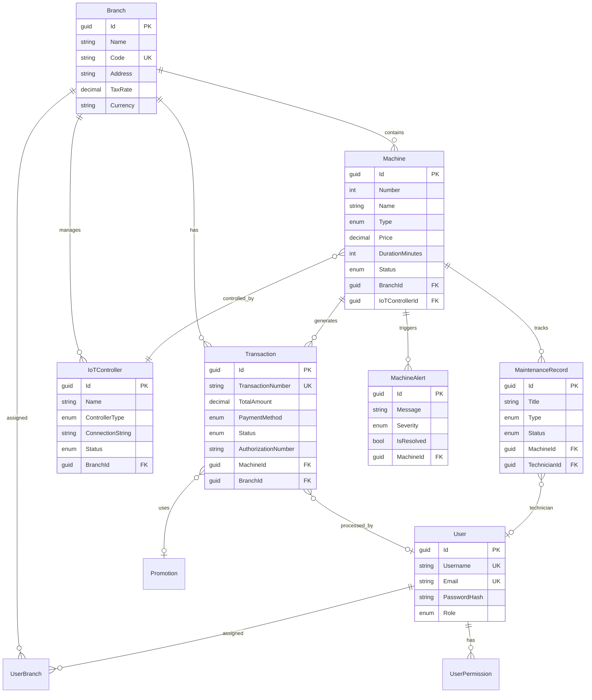
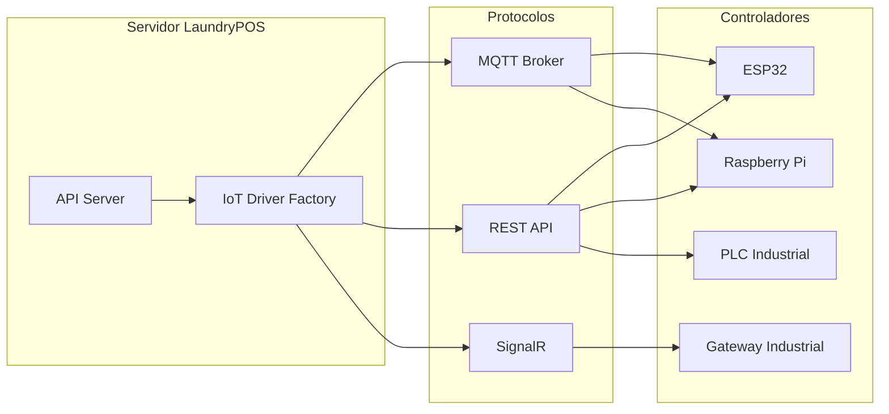
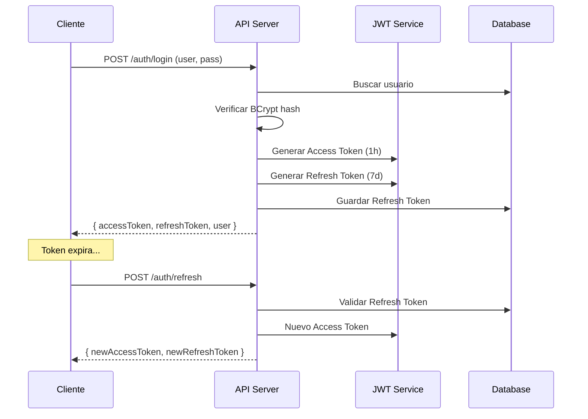

# Arquitectura del Sistema LaundryPOS

## 1. Principios de Diseño

### Clean Architecture (Arquitectura Limpia)
El sistema sigue estrictamente Clean Architecture con 4 capas concéntricas:

```
┌─────────────────────────────────────────────┐
│              PRESENTATION                    │
│        (API Controllers, SignalR)            │
├─────────────────────────────────────────────┤
│             INFRASTRUCTURE                   │
│    (EF Core, Payments, IoT, Auth)           │
├─────────────────────────────────────────────┤
│              APPLICATION                     │
│    (CQRS Handlers, Validators, DTOs)        │
├─────────────────────────────────────────────┤
│                DOMAIN                        │
│   (Entities, Interfaces, Events, Enums)     │
└─────────────────────────────────────────────┘
```

**Regla de dependencia**: Las capas internas NUNCA dependen de las externas.

### Principios SOLID Aplicados

| Principio | Aplicación |
|-----------|-----------|
| **S** - Single Responsibility | Cada handler maneja una sola operación CQRS |
| **O** - Open/Closed | Payment gateways e IoT drivers extensibles sin modificar código existente |
| **L** - Liskov Substitution | Todas las implementaciones son intercambiables a través de interfaces |
| **I** - Interface Segregation | Interfaces específicas por repositorio (IMachineRepository vs IRepository) |
| **D** - Dependency Inversion | Todo se inyecta via DI; el dominio define interfaces, infrastructure implementa |

### Patrones de Diseño Utilizados

| Patrón | Uso |
|--------|-----|
| **CQRS** | Separación de comandos y consultas via MediatR |
| **Repository** | Abstracción del acceso a datos |
| **Unit of Work** | Transaccionalidad atómica entre repositorios |
| **Factory** | PaymentGatewayFactory, IoTDriverFactory |
| **Strategy** | Diferentes gateways de pago / drivers IoT |
| **Observer** | Eventos de dominio + SignalR real-time |
| **Mediator** | MediatR para desacoplamiento de handlers |
| **Pipeline** | Validation + Logging behaviors en MediatR |

---

## 2. Diagrama de Capas



---

## 3. Flujo de Pago (Core Business Flow)



---

## 4. Modelo de Datos



---

## 5. Comunicación IoT



### Protocolo de Comunicación

| Comando | Descripción | Parámetros |
|---------|-------------|-----------|
| `StartMachine` | Iniciar ciclo | `duration_minutes` |
| `StopMachine` | Detener máquina | - |
| `PauseMachine` | Pausar ciclo | - |
| `RestartController` | Reiniciar controlador | - |
| `Heartbeat` | Verificar conexión | - |
| `Status` | Consultar estado | - |

### Tópicos MQTT

```
laundrypos/{branchId}/{machineId}/command    → Enviar comandos
laundrypos/{branchId}/{machineId}/status     → Recibir estados
laundrypos/{branchId}/{machineId}/heartbeat  → Heartbeat
laundrypos/{branchId}/{machineId}/alert      → Alertas
```

---

## 6. Seguridad

### Autenticación y Autorización



### Políticas de Autorización

| Política | Roles |
|----------|-------|
| `AdminOnly` | Administrator |
| `SupervisorOrAbove` | Administrator, Supervisor |
| `EmployeeOrAbove` | Administrator, Supervisor, Employee |
| `TechnicianAccess` | Administrator, Supervisor, Technician |

### Medidas de Seguridad
- Passwords hasheados con BCrypt (work factor 12)
- JWT con firma HMAC-SHA256
- Refresh tokens con rotación
- Lockout automático tras 5 intentos fallidos (15 min)
- Soft-delete en todas las entidades
- Audit log de todas las operaciones
- Query filters para datos eliminados
- CORS configurado
- HTTPS enforced

---

## 7. Escalabilidad

### Estrategia Multi-Tenant (por Sucursal)

```
┌─────────────────────────────────────┐
│         Load Balancer (Nginx)       │
├──────────┬──────────┬───────────────┤
│  API #1  │  API #2  │    API #N    │
│  (Pod)   │  (Pod)   │    (Pod)     │
├──────────┴──────────┴───────────────┤
│          SQL Server Cluster         │
│      (Branch-level partitioning)    │
└─────────────────────────────────────┘
```

- **Horizontal**: Múltiples instancias API detrás de load balancer
- **Vertical**: SQL Server con partitioning por BranchId
- **Cache**: Redis para dashboard data y configuraciones
- **Queue**: RabbitMQ/Azure Service Bus para procesamiento asíncrono
- **Microservicios**: Preparado para extraer módulos (pagos, IoT) como servicios independientes
