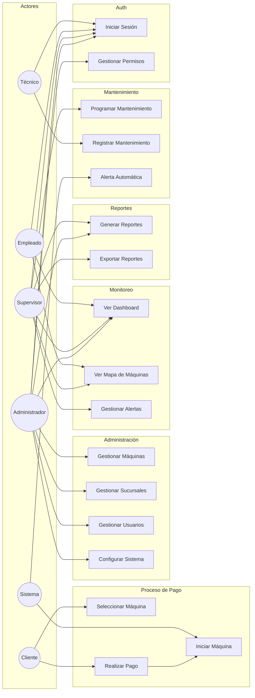
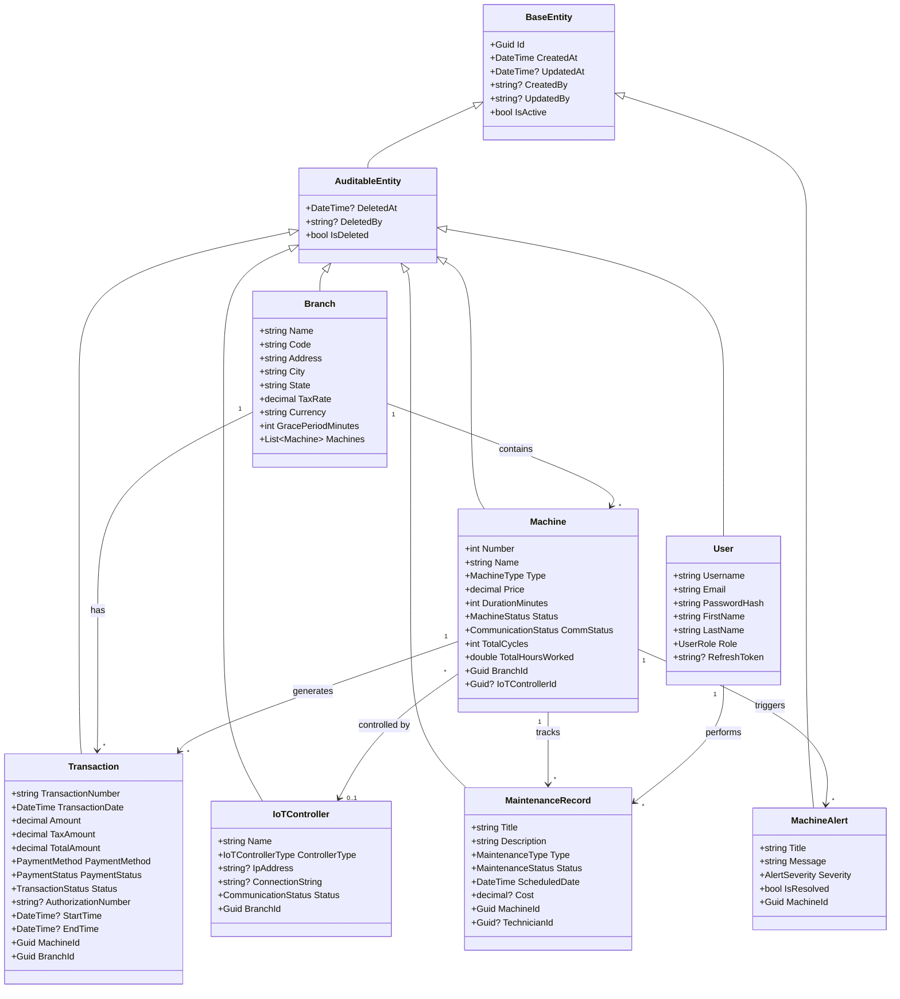
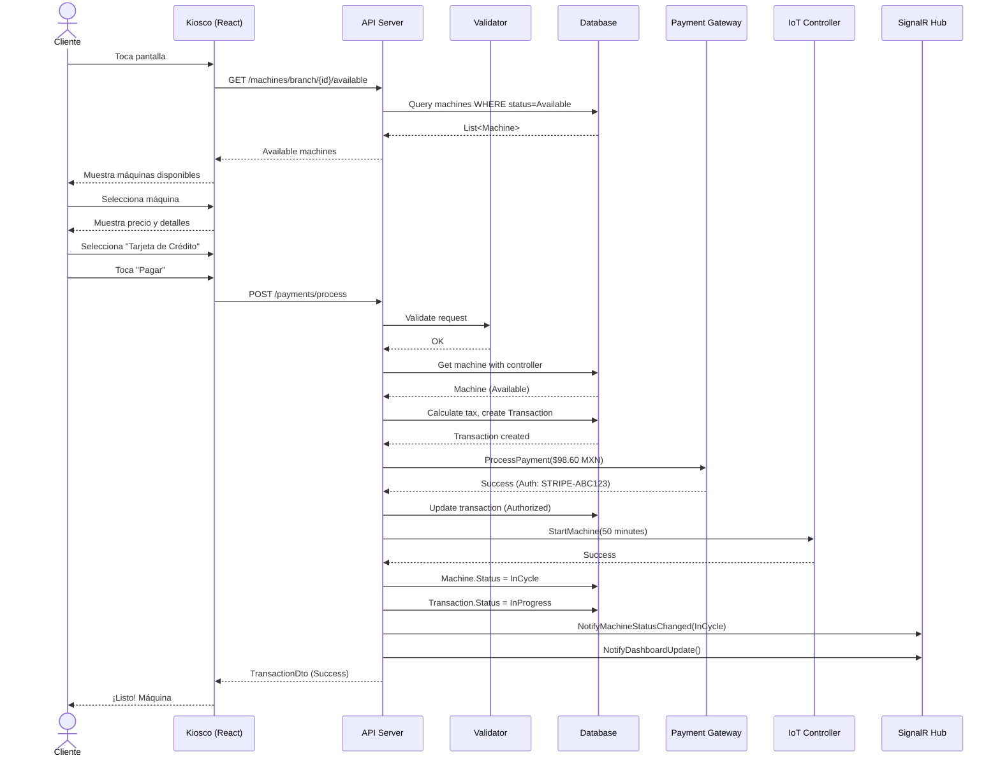
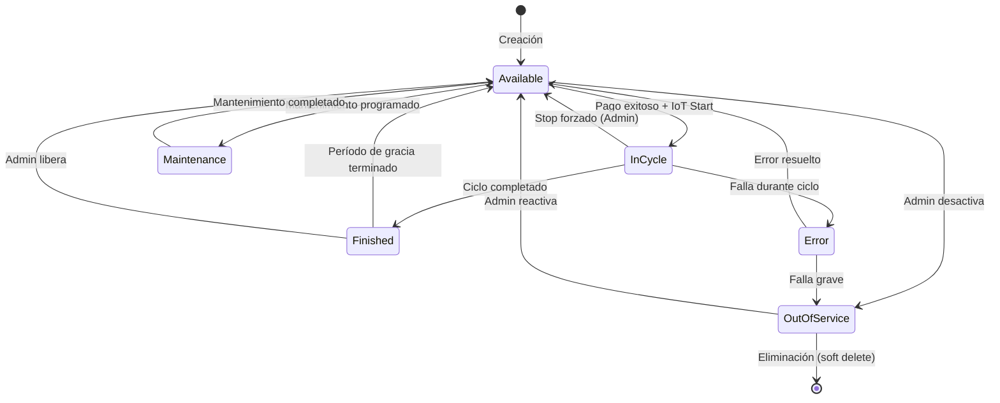
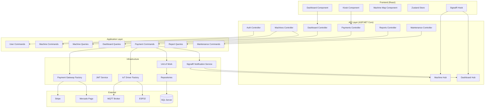
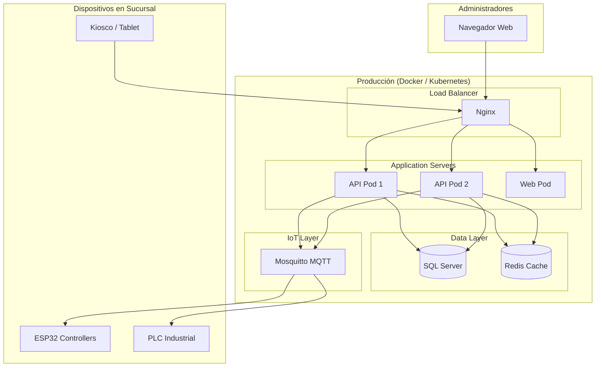

# Diagramas UML - LaundryPOS

## 1. Diagrama de Casos de Uso

## 2. Diagrama de Clases (Domain Layer)

## 3. Diagrama de Secuencia - Proceso de Pago

## 4. Diagrama de Estados - Máquina

## 5. Diagrama de Componentes

## 6. Diagrama de Despliegue

